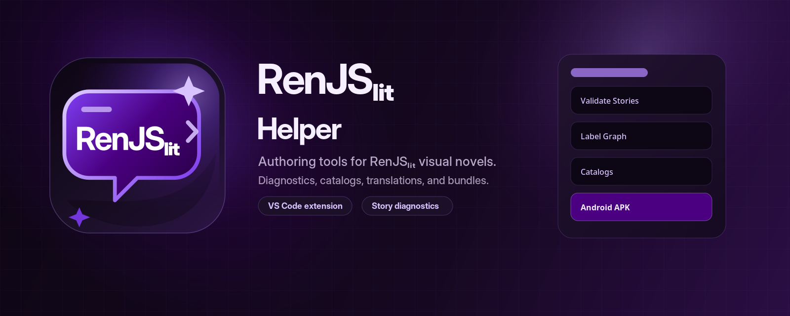
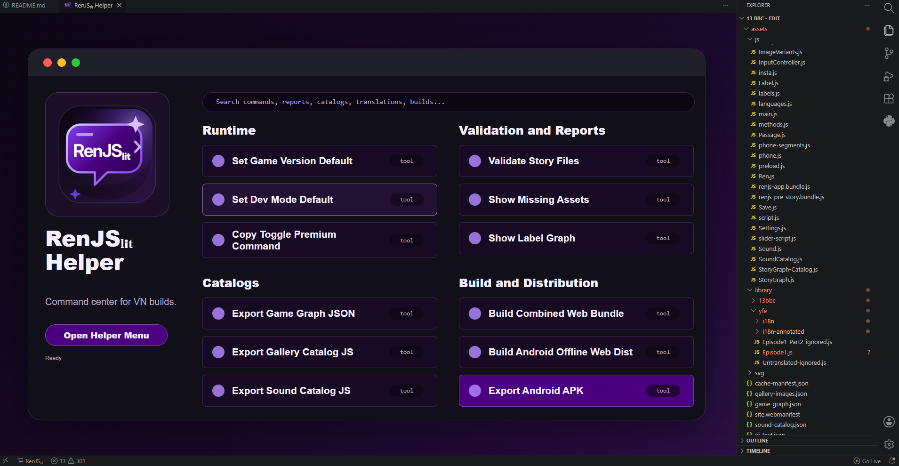

# RenJSₗᵢₜ

**RenJSₗᵢₜ** is a web-first visual novel system for writing scenes, phone conversations, and branching story flow as readable text blocks inside JavaScript labels.

At its center is a small story language: labels return text written between backticks, and the runtime parses that text into visual novel steps. Those steps can show images or video, display dialogue, play sound, branch through choices, update story state, open phone surfaces, run chat sequences, and feed graph and translation tools.

```text
story label text → RenJSₗᵢₜ parser → prepared steps → web visual novel runtime
```

The goal is to keep a VN project static and inspectable while still supporting the pieces a larger visual novel needs: scene flow, character dialogue, chat threads, translation, galleries, graph metadata, asset discovery, and web/Android-oriented builds.

## The story language

A RenJSₗᵢₜ scene is usually written as a JavaScript function that returns a backtick block. The text inside the block is the actual scene script.

```js
function $Troy_2() {
  return `
    @graph title "Conversation with Troy"

    @scene "1"

    Troy:
      So, how many boyfriends does she have now?

    ?
      "Spend time with Troy" -> continue premium=true
      "Leave" -> $Joseph_1
    end

    John:
      What?
`;
}
```

The important part is that the story remains readable as a script. The runtime turns that script into ordered steps, but the source still looks like an authoring language rather than a large object graph.

## What RenJSₗᵢₜ understands

| Story element            | Shape in the script                         | Role                                                   |
| ------------------------ | ------------------------------------------- | ------------------------------------------------------ |
| **Scene media**          | `@scene "name"`, `@video "name"`            | Changes the current image or video.                    |
| **Dialogue**             | `Character(act):` followed by indented text | Displays a speaker, expression/action, and line text.  |
| **Narration**            | Quoted text                                 | Displays narrator prose without a speaker.             |
| **Choices**              | `?` / `"Text" -> target` / `end`            | Creates branching VN choices.                          |
| **Story state**          | `@story flag = true`, `@story score += 1`   | Writes scoped story progress.                          |
| **Runtime state**        | `@set player.dayNum = 3`                    | Updates safe runtime paths.                            |
| **Conditions**           | `@if condition` / `@else` / `end`           | Includes or skips blocks based on state.               |
| **Audio**                | `@sfx`, `@music`, `@ambience`               | Plays or stops sound layers.                           |
| **Timing**               | `@wait 0.5`                                 | Holds a step for a duration.                           |
| **Phone/chat hooks**     | `@phone`, `@chat`                           | Moves into phone or messenger surfaces.                |
| **Graph hints**          | `@graph title "..."`                        | Gives authoring and graph tools a readable node title. |
| **Translation aliasing** | `@translateAs $OtherLabel`                  | Reuses another label as the translation source.        |

This makes the engine feel closer to a writing format than a pure programming API. Most scene logic can stay in the label text, while custom functions remain available when a scene needs something specific.

## Branching and state

Story state can be written directly from the script and then used by later conditions.

```js
function $AskEllieWhatChanged() {
  return `
@if Dream.answered==false

  @sfx bing

  "bing"

  Dream:
    Last message, John. Sorry for bothering you
@else
  Ellie:
    Forget I said anything.
end
`;
}
```

That pattern is what lets RenJSₗᵢₜ keep branching scenes readable: the label says what happens, what state changes, and how later text responds to that state.

## Chat labels

RenJSₗᵢₜ also has a chat-oriented label format for phone and messenger sequences. These labels are still backtick text blocks, but they describe message threads rather than textbox scenes.

```js
function $Ellie_Chat1() {
  return `
John:
  [choice]
  "Call her"

John:
  I'm gonna call you right now

@call-messenger Ellie duration=6500 result=missed sound=3rings

John:
  [call type=missed direction=outgoing]
  
John:
  Why didn't you pick up?

@delay 3000

@stutter 1000

@delay 2000

Ellie:
  I'm just having fun, John! I'm not gonna let you scold me?
`;
}
```

Chat labels support normal messages, system messages, day markers, online/offline events, delays and stutters, images, files, voice messages, stickers, links, calls, reactions, and chat choices. The result is that a phone conversation can be authored as text while still behaving like a live messenger thread.

## Translation and localization

Translation is part of the authoring model rather than a separate afterthought. The runtime can translate line text by label, reuse annotated translated labels, apply variables, update character names, shape localized digits, and switch layout direction for RTL languages.

That matters for visual novels because the same label may need to serve:

```text
original story text
translated story text
translated choice text
translated character actions
translated UI/support text
localized protagonist or character names
RTL display direction
```

RenJSₗᵢₜ keeps those concerns close to the label system, so text display, chat previews, save metadata, and phone UI can respond to the active language together.

## Runtime shape

RenJSₗᵢₜ projects are built around ordinary web files:

```text
story labels
runtime JavaScript
static assets
language files
catalogs and generated metadata
web distribution output
Android-oriented static web output
```

The runtime prepares labels before display, caches parsed steps, resolves scene addresses, preloads nearby media, replaces character names, applies translations, records story rollback state, and advances through scene steps. The same static project shape can then be used for browser builds and Android-oriented offline bundles.

## RenJSₗᵢₜ Helper

<p align="center">
  
</p>

Because RenJSₗᵢₜ projects are made from readable labels, static assets, generated catalogs, and build artifacts, **RenJSₗᵢₜ Helper** exists as the editor-side command center around that workflow.

It brings the supporting work around a static web VN into one VS Code surface: story indexing, diagnostics, graph views, asset reports, catalog generation, translation preparation, bundle building, and Android-oriented export helpers.

The tool sits beside the RenJSₗᵢₜ engine as a production companion. RenJSₗᵢₜ handles the runtime side of a static HTML/JS visual novel; RenJSₗᵢₜ Helper focuses on the authoring and maintenance layer around that project.

## At a glance

| Area                   | What it does                                                                                                              |
| ---------------------- | ------------------------------------------------------------------------------------------------------------------------- |
| **Story intelligence** | Indexes labels, functions, characters, game metadata, speakers, and story relationships.                                  |
| **Diagnostics**        | Flags duplicate labels, unresolved references, unknown speakers, graph-hint issues, missing assets, and translation gaps. |
| **Reports**            | Opens project summaries, label graphs, unreachable-label checks, missing-asset views, and sound audits.                   |
| **Catalogs**           | Exports game graphs, story graph catalogs, gallery catalogs, sound catalogs, and UI text files.                           |
| **Translations**       | Prepares UI text exports, missing-text checklists, annotated translation files, and coverage diagnostics.                 |
| **Build helpers**      | Rebuilds cache manifests, creates combined web bundles, prepares offline Android web distributions, and exports APKs.     |
| **Runtime defaults**   | Generates helper commands for game version, dev mode, online mode, image extension defaults, and premium toggles.         |

## Command center

<p align="center">
  
</p>

The helper menu is organized around the way a RenJSₗᵢₜ project moves from writing to shipping:

```text
write story files → validate references → inspect reports → export catalogs → prepare translations → build web/mobile output
```

Rather than treating those as scattered scripts, RenJSₗᵢₜ Helper collects them into a single authoring surface inside VS Code.

## Feature map

### Story authoring

RenJSₗᵢₜ Helper reads the project structure and builds an index of story labels, callable functions, character definitions, game metadata, and story-library files. That index powers navigation, reference checks, speaker decoration, premium-label highlighting, and quick access to the currently edited label.

### Validation and reports

The diagnostics layer is designed to catch the kinds of story and production mistakes that are easy to miss while writing a branching VN:

| Report or check           | Purpose                                                                                                            |
| ------------------------- | ------------------------------------------------------------------------------------------------------------------ |
| **Story validation**      | Detects duplicate labels, unknown labels, unknown callable functions, unknown speakers, and malformed graph hints. |
| **Project index summary** | Shows what the helper understands about the current RenJSₗᵢₜ project.                                              |
| **Missing assets**        | Surfaces referenced images, sounds, or files that are not present where expected.                                  |
| **Label graph**           | Turns story metadata and graph hints into a readable flow view.                                                    |
| **Unreachable labels**    | Finds story labels that are present but not reachable from the known graph.                                        |
| **Sound audit**           | Reviews sound usage and catalog consistency.                                                                       |

### Catalogs and generated metadata

The catalog commands convert authoring-time project knowledge into structured data that the runtime or build process can use later.

| Export                          | Output role                                                       |
| ------------------------------- | ----------------------------------------------------------------- |
| **Game graph JSON**             | Author-facing view of the current story graph.                    |
| **Story graph catalog JS**      | Runtime-ready story graph catalog.                                |
| **Gallery image list JSON**     | Flat gallery image reference list.                                |
| **Gallery catalog JS**          | Runtime-ready gallery catalog.                                    |
| **Sound catalog JSON / JS**     | Sound reference data for auditing and runtime use.                |
| **UI text JSON**                | UI/runtime text extraction for localization work.                 |
| **Missing UI text JSON**        | Checklist of text keys that still need coverage.                  |
| **Annotated translation files** | Translation-oriented files generated from labeled source content. |

### Build and distribution helpers

RenJSₗᵢₜ projects target static deployment, so the helper includes commands for preparing web and Android-oriented artifacts from the same source material.

| Build helper                         | Purpose                                                      |
| ------------------------------------ | ------------------------------------------------------------ |
| **Cache manifest rebuild**           | Refreshes cached asset references for deployment.            |
| **Combined JS / CSS bundles**        | Produces compact runtime bundles.                            |
| **Combined web bundle / website**    | Prepares a static web distribution.                          |
| **Android offline web distribution** | Packages the web project shape for offline Android use.      |
| **Android APK export**               | Runs the Android export path from the prepared project.      |
| **Premium-label separation**         | Extracts premium-labeled story content into a separate file. |

## Project shape it understands

RenJSₗᵢₜ Helper is designed around a web-first visual novel project with story, script, asset, and distribution folders. The default shape is:

```text
assets/library/             story and library files
assets/js/                  runtime scripts and story scripts
assets/js/Characters.js     character definitions
dist/                       generated bundles and exports
```

The important idea is that the project remains static and inspectable: source files are ordinary JavaScript and asset folders, while helper commands generate the reports, catalogs, bundles, and mobile-oriented outputs around them.

## Overall role

RenJSₗᵢₜ Helper is less a standalone product page and more a map of a production workflow. It shows how the extension supports the RenJSₗᵢₜ ecosystem: keeping story files navigable, catching mistakes early, exposing project structure, preparing runtime metadata, and turning static VN projects into web and Android-ready builds.
